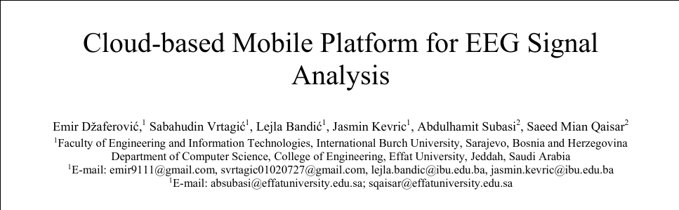
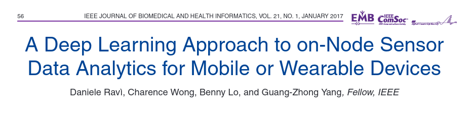
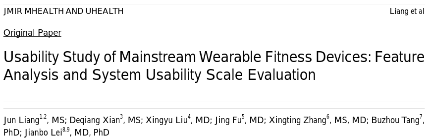
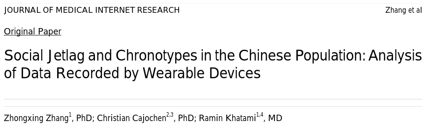
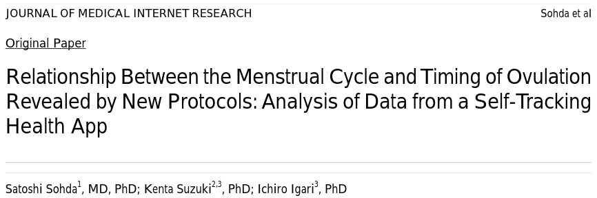
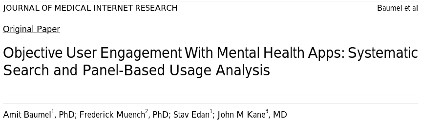
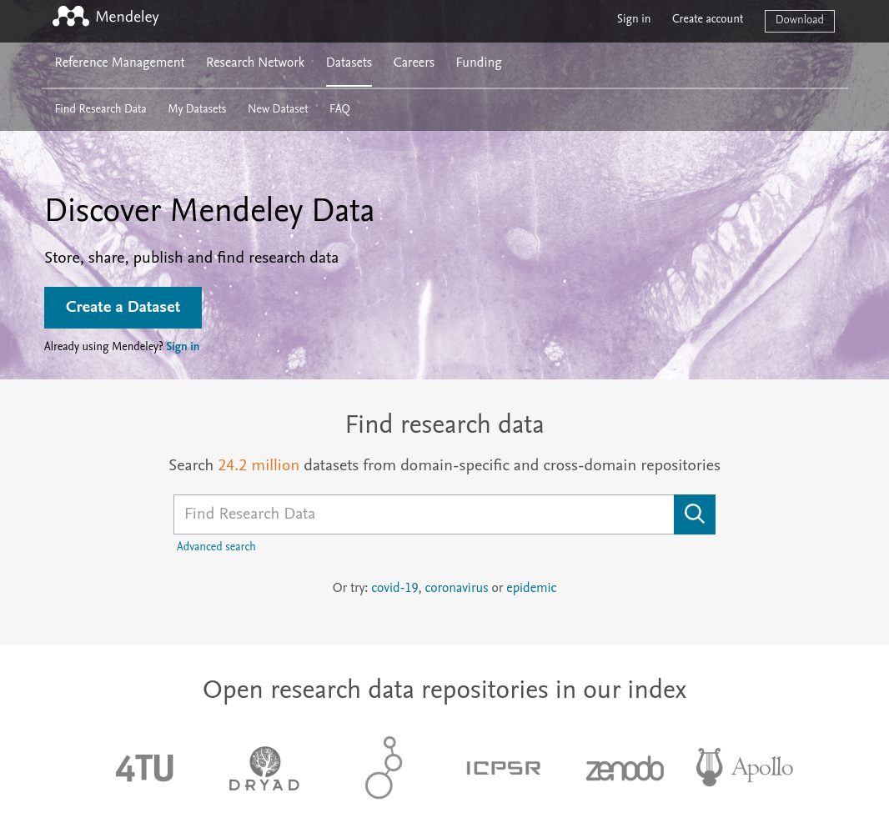
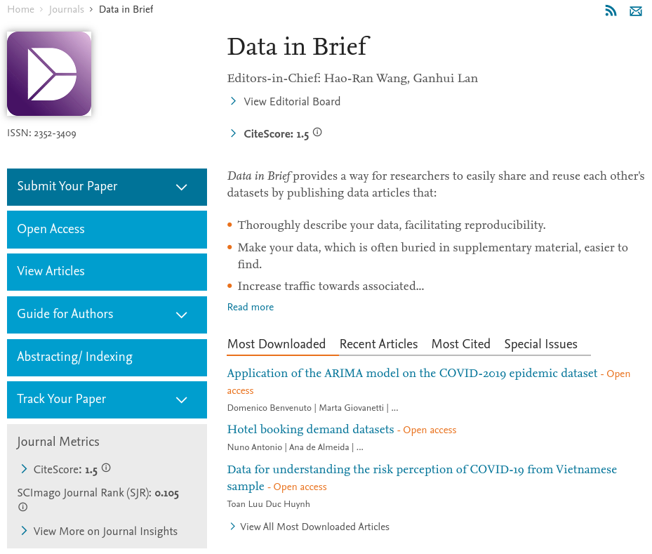
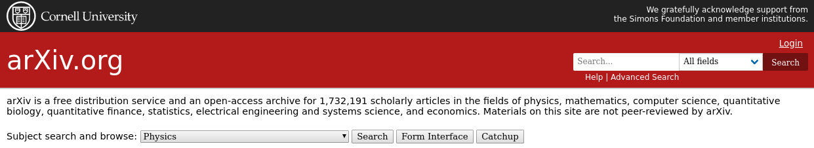

```{r init, echo=F}
knitr::opts_chunk$set(echo=F, eval=T, message=F, warning=F, error=F)
```

- Ilustrasi pentingnya data (3 menit):
  - H-index peneliti
  - Persyaratan pengajuan guru besar
  - Riset yg berkesinambungan

- Mahadata (10 menit):
  - Definisi
  - Lingkup
  - Integrasi
  - Kolaborasi

- Bibliometrics penelitian (10 menit):
  - Indonesia
  - Oceania, SEA, Asia, Eropa, Amerika

- Open Science (7 menit):
  - Reproducible research
  - Media publikasi data dan metode

???

- This is a hidden note
- Press `p` again to hide

---

# Why Data?

.pull-left[
  
 ]

.pull-right[
  
]

???

## Researcher perspective

- Good research = higher H-index
- Necessary to build a career

## Healthcare perspective

- Better patient management
- Estimating treatment outcome
- Insight on clinical judgment

---

class: bottom, right
background-image: url("https://static.vecteezy.com/system/resources/previews/000/508/999/original/icon-of-industry-4-0-concept-internet-of-things-network-smart-factory-solution-manufacturing-technology-automation-robot-with-gray-background-vector.jpg")
background-size: cover

???

## Industrial revolution?

- Widely known as an Industry 4.0 era, or simply a **4.0 era**
- Incorporate smart technology into daily livings

## How does Indonesia fare?

- The government encourage research in higher education institutions
- Expected output: investigation, analysis, policy brief, and product

---

# What is Big Data?

.right[.pull-left[
  ### Volume
  ### Variety
  ### Velocity
  ### Variability
  ### Veracity
]]

.pull-right[
  
]

H. Liao, M. Tang, L. Luo, et al. “A Bibliometric Analysis and Visualization of Medical Big Data Research”. In: _Sustainability_ 10.2 (Jan. 2018), p. 166. DOI: 10.3390/su10010166.


???

## Volume

- Big data often has stupendous entries
- Columns represent different measurements
- Rows represent measured subjects / objects

## Variety

- Structured vs unstructured format
- Research context often relies on structured data
- Healthcare context often involves unstructured data (e.g. extra notes on
  medical records)

## Velocity

- Big data is expansive
- They grow rapidly
- Continuous flow of information
- Integration with automatic measuring devices

## Variability

- Unpredictable data flow (e.g. global COVID-19 impact)

## Veracity

- Different data quality

---

# The Scope

- Holistic: Biopsychosocial aspect
- Personalized medicine?


???

## Holistic

- The scope of big data in medical contexts is enormous
- It incorporates biopsychosocial aspects of the patient
- Readily-available real-world data, yet currently unused:
  - Wearable smart devices
  - Fitness tracker application
  - Menstrual cycle diary
  - EEG kit and brainwave

## Personalized

- How do we use all the data to formulate a personalized advise?
- How do we design patient nutritional intake based on their daily activity?

---

### Available real-world data

.pull-left[


]

.pull-right[

]

???

#### Mindwave

- Record brain electrical activity
- Process it in a wavelet form
- Use it to communicate with computer (as a BCI mediator)

#### Smartband / Smartwatch

- Fitness tracker app
- See: HR, RR, blood pressure, oxygen level, distances, etc.
- Measure (recorded) daily activity

#### Period tracker

- A period diary
- Estimate menstrual cycle

---

### Research examples

.pull-left[


<br>



<br>


]

.pull-right[


<br>



<br>


]

???

#### Top Left

- Use EEG kit (e.g. mindwave) to track 24-h brainwave changes in epileptic
  patients
- Wireless pairing of EEG devices with smartphones, collect data locally
- Data sent to the cloud for further analysis: BCI, neurofeedback, seizure
  prediction

#### Middle Left

- Real-time analysis on data acquired from smart devices
- Output: Human Activity Recognition
- Implementation: daily-activity diary, for instances in Parkinson's patients

#### Bottom Left

- Conclude the functional homogeneity across different wearable devices

#### Top Right

- Sleep data recorded on smart watches
- Delineate chronotype of social jet lag in Chinese population

#### Middle Right

- Detailed relationships between menstrual cycle periods, follicular phase, and
  luteal phase
- By aggregating the data, self-tracking apps can predict ovulation day

#### Bottom Right

- Describes phenomenon among general population installing mental health apps
- Many people install and use mental health apps
- Only a small portion used the app for a long period of time

---

# Integration


- Impact on clinical practices
- How researcher can utilize the data
- Knowledge graph

???

## Impact on clinical practices

- Prevention, early detection, prompt treatment
- Recognize vulnerable patients in contracting certain diseases
- Shorter hospital length of stay

## Data utilization

- Analyze the complexity
- Formulate a better recommendation with given evidence
- 

## Knowledge Graph

- Drug - drug interaction
- Metabolomics
- Network analysis

---

# Collaboration


- Inter-disciplinary research
- Multicentre approach
- Consortium
???

## Inter-disciplinary research

- Big data as a platform to centralize data acquisition
- *Every* field can contribute their findings
- More accessible data = better interdisciplinary collaboration

## Multicentre approach

- Simpler to maintain collective datasets
- Possibility of designing a real-time data sharing

## Consortium

- A consortium often requires contribution in a form of shared data
- International collaborative acts benefit all involved parties
--

- **Biobank for Indonesia**

???

## Biobank for Indonesia

- An answer for higher demand on shared health informatics
- Challenges?
  - Store
  - Analyze
  - Visualize

---

class: right, bottom


# Medical Research

### ...during data explosion

???

Depicted is a network representation of data points connected to one another

---

## Increasing concern on...

.pull-left[
**Automating daily tasks**

**Understanding complexities**

- Imaging
- Genomics
- Signal processing
]

.pull-right[]

<br> <br> <br> <br> <br> <br> <br> <br> <br> <br> <br> <br> <br> <br> <br> <br>

A. Belle, R. Thiagarajan, S. M. R. Soroushmehr, et al. “Big Data Analytics in Healthcare”. In: _BioMed Research International_ 2015 (2015), pp. 1-16. DOI: 10.1155/2015/370194.

???

### Automating daily tasks

- Medical record input and archiving
- Generating drug recommendation given the patient profile
- Merging data for further analysis

### Understanding complexities

- Data obtained from human bodies are *massive*
- Rigorous methods are essential to understand what the data imply

---

# Open Science

- Reproducible research
- Rigorous methodology


<br>

R. Vicente-Saez and C. Martinez-Fuentes. “Open Science now: A systematic literature review for an integrated definition”. In: _Journal of Business Research_ 88 (Jul. 2018), pp. 428-436. DOI: 10.1016/j.jbusres.2017.12.043

???
- Make science accessible to everybody
- Transparent, developed through collaborative networks

---

background-image: url(https://www.sciencefriday.com/wp-content/uploads/2017/04/rigor.jpg)
background-size: cover

???
- Richard Harris:
  - Graduated with highest honors as a BSc in Biology, UC-Santa Cruz
  - A reporter covering **science, medicine** and the environment
  - Work for the National Public Radio since 1986

--
???
- On 2014:
  - took sabbatical leave to write his concern on biomedical research
  - Anecdotes, personal stories, interviews with top biomedical researchers

--
???
- More than half published investigations **is not replicable**
- Implying bad practices in science
- Resulting in unreliable outcome

---

## Sharing Platform

.pull-left[]

.pull-right[]



???
- Left: Mendeley data storage
- Right: Data in Brief journal
- Bottom: Arxiv, a preprint repository
- Others to consider:
  - ResearchGate
  - SSRN $\to$ Preprint by Elsevier
  - Open Science Framework
  - Gates Open Research

---

### Why Open Science?

- Expedite multicentre research
- Aid data collection
- Avoid redundant investigations
- Design a **Responsible Research and Innovation** framework

<br> <br> <br> <br> <br> <br> <br> <br> <br> <br> <br> <br>

M. Burget, E. Bardone, and M. Pedaste. “Definitions and Conceptual Dimensions of Responsible Research and Innovation: A Literature Review”. In: _Science and Engineering Ethics_ 23.1 (Apr. 2016), pp.  1-19. DOI: 10.1007/s11948-016-9782-1

---

# Conclusion

- Big data is the new **economic asset**
- Will greatly impact healthcare practices
- Other countries have started mining
- What about Indonesia?

.pull-right[

]

M. Schäfer. “The fourth industrial revolution: How the EU can lead it”. In: _European View_ 17.1 (Mar. 2018), pp. 5-12. DOI: 10.1177/1781685818762890


---

# Take home notes

- Starts from supporting open science
- Make our data available and methods reproducible
--

- Challenges in establishing Big Data?
  - Storage
  - Analysis
  - Visualization
